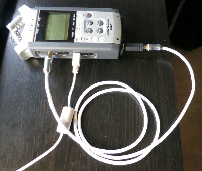
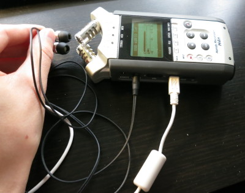

.. rst3: filename: index.html

##################################
Latency free overdubbing in Ardour
##################################

*Published on 30 September 2013.*

In this article I explain how to set up JACK and Ardour for latency free
overdubbing.

Please send feedback to ricli85@gmail.com.

Where is latency introduced?
++++++++++++++++++++++++++++

Let's say we have one track with a metronome click. Now we want to record a
chord progression over this metronome click. ::

    playback  |>   >   >   >   |>   >   >   >   |
    ----------|----------------|----------------|
    recording |                |                |
                               t

At time t, we are at the beginning of bar 2. It starts with a metronome click.
At time t, Ardour sends the first sample of the metronome click to the speakers.
It passes various stages in the computer and a DA converter in our audio
interface. It will take an amout of time before we actually hear the sound. We
call that time output delay (OD). When we hear the sound we react to it and play
a chord on our instrument. It will take an amount of time for our microphone to
capture the sound, convert it to a digital signal, and send it to Ardour. We
call that time input delay (ID).

* At time t       - Ardour sends playback signal to speakers
* At time t+OD    - We hear the metronome click
* At time t+OD+ID - Our reaction has been recorded and arrived in Ardour

The time between Ardour sending the signal to the speakers and it receiving a
recorded signal back is thus OD+ID.

In order for the two tracks to line up perfectly, Ardour has to compensate for
this latency. It can do that, but we need to know the input and output latency
of our system.

Measure I/O latency
+++++++++++++++++++

Setup
*****

In order to measure the I/O latency, we need to create a loop. That way a test
program can send a signal and measure the time it takes for the signal to travel
through the system.

I use a Zoom H4n as a USB audio interface. The first way to close the loop is
with a direct patch cable:

We connect the patch cable from the headphone line out to a line in. The H4n has
combo inputs that works for microphones, electric instrument, or line level
sources.

The second way to close the loop is with a speaker and a microphone:

We connect headphones to the headphone line out and put them close to the built
in microphones on the H4n.

Process
*******

Now that we have the loop set up in hardware, this is the process to measure the
I/O latency:

1. **Start JACK with the given settings**

   From QjackCtl, click "Setup...":
   
   .. image:: jack_setup.png
   
   Adjust frames/period, sample rate, and periods/buffer. Make sure latency I/O
   are both set to 0 (default).
   
   Click "OK" to close the dialog, then click "Start".

2. **Start jack_iodelay**

   Run the following command in the terminal::
   
       jack_iodelay
       
3. **Connect**

   From QjackCtl, click "Connect":
   
   .. image:: jack_connect.png
   
   This will create the loop in software as well so that jack_iodelay can
   capture the signal that it sends out.
   
4. **Observe output**

   We should see something like this::
   
       4921.269 frames    102.526 ms total roundtrip latency
         extra loopback latency: 1849 frames
         use 924 for the backend arguments -I and -O

   Note that the suggested number (924) is only valid for the configuration that
   we entered in step 1.
   
   To compensate for the roundtrip latency, we should enter this number for both
   the input and the output latency in the settings dialog in step 1.

Results
*******

The Zoom H4n supports 44.1kHz and 48kHz. I ended up with the following
measurements:

================= ============== ============== ========= ====================== ==================
Sample rate (kHz) Frames/Period  Periods/Buffer Loop type Roundtrip latency (ms) Suggested I/O
================= ============== ============== ========= ====================== ==================
44.1              1024           2              Direct                           ~1100 (increasing)
44.1              1323 (44.1*30) 2              Direct                           ~1000 (increasing)
48                1024           2              Direct    101.5                  ~897
48                1024           2              Mic       122.4                  ~895
48                1024           3              Direct    122.8                  ~899
48                1024           3              Mic       122.4                  ~889
48                1056 (48*22)   2              Direct    104.4                  ~920
================= ============== ============== ========= ====================== ==================

Conclusions
***********

USB and 48kHz
^^^^^^^^^^^^^

When measuring using 44.1kHz, the suggested value for latency I/O kept
increasing. I asked about this on IRC::

    <ricli85> Some reports on the increasing number that jack_iodelay gives me:
    If I set 48kHz sample rate and frames/period=1056 (multiple of 48), I seem
    to get a more stable number.
    <las> ricli85: many USB devices work correctly *only* at 48kHz

Conclusion: Always use 48kHz sample rate for our USB audio interface.

Persios/buffer
^^^^^^^^^^^^^^

This parameter doesn't seem to have any effect on the roundtrip latency.

Direct vs mic
^^^^^^^^^^^^^

The roundtrip latency seems to be smaller when using the mic than when using the
direct patch cable.

This is a bit surprising to me, because when using a mic, the sound has to
travel that extra distance through the air. But the delay was not significantly
smaller, and during the measurements, the delay number kept going up and down
(although stabalizing around some value).

